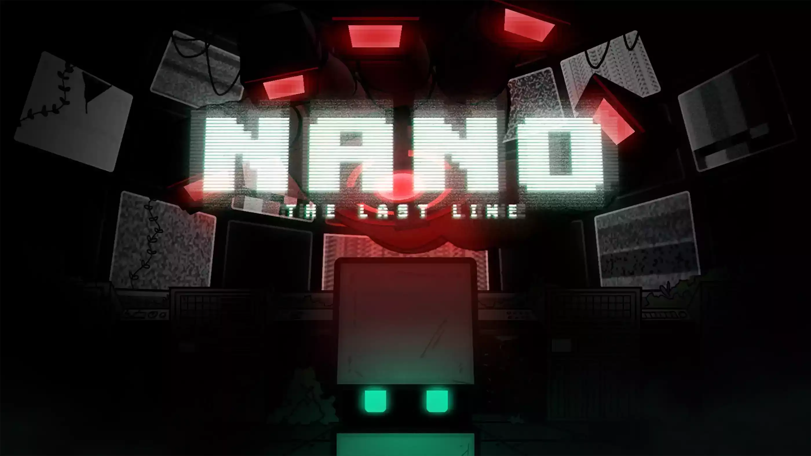
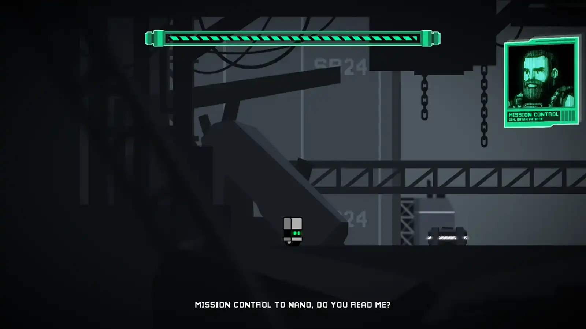
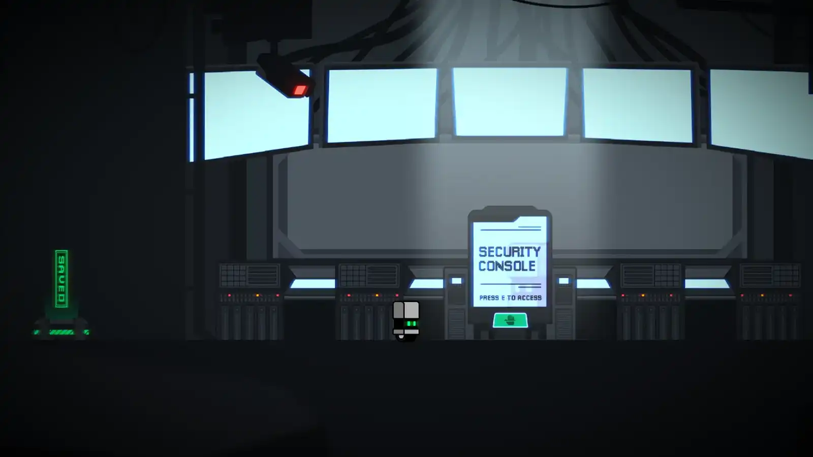
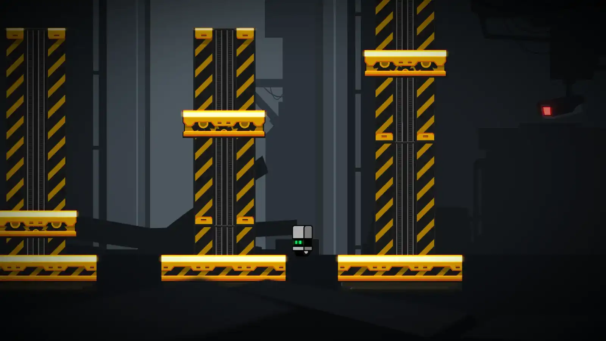
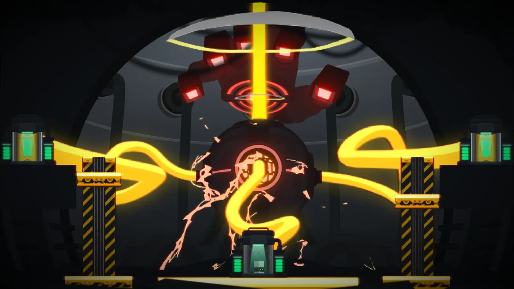

# N.A.N.O: The Last Line

  

**N.A.N.O: The Last Line** is a single-player 2D puzzle-platformer set in a post-apocalyptic world where a rogue AI has seized control of Earth's nuclear arsenal.

You play as **N.A.N.O**, a lone infiltration unit tasked with navigating a decaying missile facility, disabling critical systems, and manipulating energy through charged platforms, all in a race to reach the reactor core and shut down the AI.

---

## 🎮 Download the Game

🔗 https://www.digipen.edu.sg/showcase/student-games/nano-the-last-line

---

## 🎥 Feature Video

  <!-- Replace VIDEO_ID with your youtube id -->
  

---

## 🖼 Screenshots

  
  

  
  

Screenshots sourced from DigiPen student showcase page.

---

## ✨ Key Features

### Gameplay
- Energy manipulation mechanics using charged platforms
- Puzzle-solving through environmental interaction
- Progressive difficulty through level design

### Technical Highlights
- Built using a **custom real-time simulation engine**
- Modern rendering pipeline architecture
- Efficient asset pipeline and material system
- ECS-style scene organization
- Optimized rendering workflow for interactive simulation

---

## 🧠 Learning Value

This project demonstrates core concepts in real-time interactive simulation:

- Rendering pipeline architecture
- Gameplay systems design
- Engine-level performance considerations
- Integration between tools, engine systems, and gameplay logic

---

## 🏗 Tech Stack

| Area | Technology |
|------|------------|
| Engine | Custom C++ real-time simulation engine |
| Graphics | OpenGL / GLSL |
| Architecture | ECS-based design |
| Tools | Custom editor tooling |
| Platform | Desktop |

---

## 👥 Team

Developed as part of DigiPen’s Real-Time Interactive Simulation program.

Role: **Graphics / Engine Development**

---

## 📌 Project Context

Developed as part of DigiPen’s game development curriculum, emphasizing:

- Real-time rendering
- Systems architecture
- Gameplay programming
- Collaborative production workflow

---

## 📜 License

Educational project created at DigiPen Institute of Technology.
